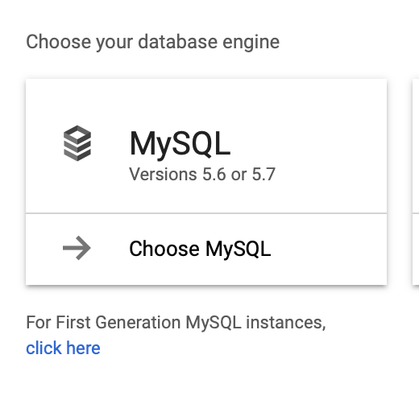

# Creation Steps

0. You musty first install Google Cloud Platform CLI

    * for MAC see https://cloud.google.com/sdk/docs/quickstart-macos

1. Create Google Cloud Platform (GCP) Project

    * `gcloud projects create paullinck-burgerlog`

2. Enable AppEngine for the project

    * select location `us-central`
    * 
    * Wait ...
    * 
    * Start Configuring for Node.js
    * 
    * Pick node.js
    * 
    * Wait ...
    * 

3. Setup Database

    * 
    * 
    * 
    * 
    * 

4. You MUST configgure the Google Cloud SQL API as well (or you get lots of hard to understand errors)

4. Configure Connection in javascript code

    * configure `.env` file
    * configure `app.yaml` file
    * setup DB connection in code

```javascript
        // Google Cloud Platform Connection
        if (process.env.INSTANCE_CONNECTION_NAME) {
            config = {
                socketPath: `/cloudsql/${process.env.INSTANCE_CONNECTION_NAME}`,
                user: process.env.SQL_USER,
                password: process.env.SQL_PASSWORD,
                database: process.env.SQL_DATABASE
            };
        // Local DB Connection
        } else {
            config = {
                host: "localhost",
                port: 3306,
                user: "plinck",
                password: "password",
                database: "burger_db"
            };
        }
        this.connection = mysql.createConnection(config);
```

5. Deploy to Google Cloud (note this takes several minutes)

    * Make sure all dependencies are up to date in package.json (using `npm install`)
    * `gcloud config set project paullinck-burgerlog`
    * `gcloud app deploy`
    * Run app using `gcloud app browse`
    * View Logs using `gcloud app logs tail -s default`
