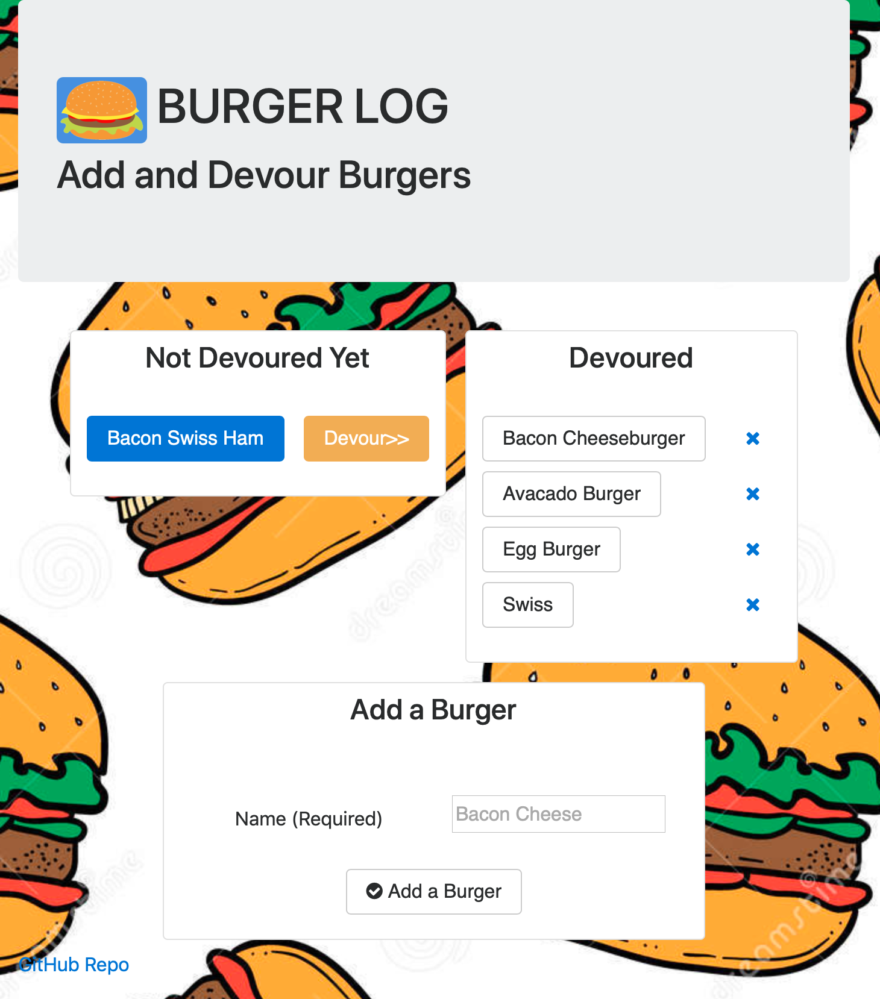

# Burger Log - Node Express Handlebars / Sequelize / Google Cloud Platform

## Overview


This application is a burger logger using MySQL, Node, Express, Handlebars and a homemade ORM. It uses the MVC design pattern, Node and MySQL to query and route data in your app, and Handlebars to generate your HTML.  I also use some client side renderring per the advice of an instructor (Sterling) to deal with Modal Dialog boxes and quick changes to HTML.

### Note

I deployed to **Google Cloud Platform** (not Heroku) since I already reached my limit on Heroku apps.  I have outlined the steps for deploying app and DB to GCP.  It is much more involved than Heroku but provides some benefits in access and scale.

* [Deployment Steps](GCP/)

## Links

* [Live Google Cloud Platform Site](https://paullinck-burgerlog.appspot.com/burgers)
* [Live Portfolio Page](https://plinck.github.io/My-Portfolio/)
* [GitHub for this](https://github.com/plinck/BurgerLog)

## Technologies Used

* [x] HTML/CSS/Javascript/JQuery/Bootstrap
* [x] SQL, mySQL and Google Cloud Platform (App Engine, SQL DB, SQL Admin Services)
* [x] Handlebars, Node.js, Express, Path

## Screenshots



### Design

* Burger Log is a restaurant app that lets users input the names of burgers they'd like to eat.

* Whenever a user submits a burger's name, the app displays the burger on the left side of the page -- waiting to be devoured.

* Each burger in the waiting area also has a `Devour it!` button. When the user clicks it, the burger will move to the right side of the page.

* The app stores every burger in a mySQL database, whether devoured or not.
  
* The user can also delete a devoured burger by clicking the delete (X) icon to the right of devoured burger.

* I used ES6 classes for all the classes/objects (e.g. Orm, Connection etc)

* Follows Model View Controller (MVC) pattern

#### Directory structure

The major files and directories from the look like the following structure:

```text
.
├── config
│   ├── Connection.js
│   └── Orm.js
│
├── controllers
│   └── burgers_controller.js
│
├── db
│   ├── schema.sql
│   └── seeds.sql
│
├── models
│   └── burger.js
│
├── node_modules
│
├── package.json
│
├── public
│   └── assets
│       ├── css
│       │   └── burger_style.css
│       └── img
│           └── burger.png
│
├── server.js
│
└── views
    ├── index.handlebars
    └── layouts
        └── main.handlebars
```

- - -

### Hosting on Google Cloud Platform

I deployed to **Google Cloud Platform** (not Heroku) since I already reached my limit on Heroku apps.  I have outlined the steps for deploying app and DB to GCP.  It is much more involved than Heroku but provides some benefits in access and scale.

* [Deployment Steps](GCP/)

- - -